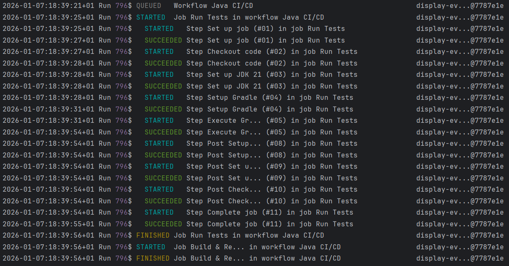

# ghwork



Command-line tool for monitoring GitHub Actions workflow runs in real time. Queries the GitHub REST API to track workflow execution state and displays domain events as they occur.

## Table of Contents

- [Overview](#overview)
- [Codebase](#codebase)
  - [Dependencies](#dependencies)
  - [Project Structure](#project-structure)
  - [Architecture Highlights](#architecture-highlights)
- [Installation](#installation)

## Overview

ghwork is a Java 21 CLI application that monitors GitHub Actions workflow runs for a specified repository. The application polls the GitHub REST API at regular intervals, compares workflow state between requests using a diffing algorithm, and outputs domain events representing state transitions.

The application maintains persistent state across executions using Java object serialization. State is stored in platform-specific application data directories. The tool tracks workflow runs, jobs, and job steps, detecting transitions such as workflow queuing, job start and completion, and step execution outcomes.

The main execution loop enforces a minimum request interval of 5 seconds between API calls to prevent the GitHub API limit from being exceeded. The application handles multiple repositories by maintaining separate state mappings for each repository.

Domain events are generated by comparing previous state snapshots with current API responses. Events are sorted chronologically and formatted for terminal output using ANSI color codes.

## Codebase

### Dependencies

The project uses Gradle for dependency management with version catalogs defined in `gradle/libs.versions.toml`.

**Runtime Dependencies:**
- `com.google.code.gson:gson:2.13.2` - JSON deserialization for GitHub API responses
- `org.fusesource.jansi:jansi:2.4.2` - ANSI terminal colors library for simpler logic

**Test Dependencies:**
- `org.junit.jupiter:junit-jupiter:6.0.1` - JUnit 5 testing framework
- `org.junit.platform:junit-platform-launcher:6.0.1` - Test execution platform

The application uses Java 21 with the application plugin configured. The main class is `com.example.ghwork.GhworkApplication`.

### Project Structure

The codebase is organized into four main packages:

**`api`** - GitHub REST API client implementations
- `GithubClient` - Abstract base class for HTTP client operations with authentication and error handling
- `WorkflowClient` - Fetches all workflow run data from a repo from the `/actions/runs` endpoint
- `JobClient` - Fetches job data from `/actions/runs/{run_id}/jobs` endpoints using parallel requests
- `WorkflowService` - Orchestrates API calls and maps workflow runs to their associated jobs
- `WorkflowResponse`, `JobResponse` - Data transfer objects for API responses

**`cli`** - Command-line interface components
- `ArgumentParser` - Validates and parses command-line arguments (repository and access token)
- `CLIArguments` - Value object containing parsed arguments
- `CLIPrinter` - Formats domain events for terminal output with ANSI color codes and padding
- `StorageService` - Manages persistent state using Java object serialization with platform-specific storage paths
- `EnvService` - Reads environment variables and system properties for configuration
- `exceptions` - Custom exception hierarchy for CLI error handling

**`domain`** - Core domain models and events
- `Repository` - Value object representing a GitHub repository identifier
- `AccessToken` - Value object for GitHub personal access token
- `WorkflowRun` - Workflow execution state including status, conclusion, and timestamps
- `WorkflowRunData` - Container for workflow run and associated jobs
- `Job` - Job execution state with steps
- `JobStep` - Individual step execution state
- `ToolState` - Persistent state container mapping runs and ignored run IDs
- `events` - Domain event hierarchy including `WorkflowQueuedEvent`, `JobStartedEvent`, `JobFinishedEvent`, `StepStartedEvent`, `StepSucceededEvent`, `StepFailedEvent`

**`diffing`** - State comparison and event generation
- `DiffingService` - Computes differences between state snapshots and generates domain events
- `WorkflowRunStatus`, `JobStatus`, `StepStatus` - Status enumeration types for state ordering

**`json`** - JSON deserialization utilities
- `JsonService` - Parses JSON responses using Gson with custom deserializers
- `InstantDeserializer` - Custom Gson deserializer from ISO-8601 timestamp strings into `Instant` objects

**`test`** - Unit tests mirroring the main package structure

### Architecture Highlights

The application follows a layered architecture with clear separation between API communication, domain logic, and presentation concerns.

**State Management:**
State persistence uses Java object serialization to a single file per application instance. The storage location is determined by operating system conventions: Windows uses `%APPDATA%`, macOS uses `~/Library/Application Support`, and Linux uses `$XDG_CONFIG_HOME` or `~/.config`. The serialized data structure is a `Map<Repository, ToolState>` where each repository maintains its own workflow run tracking state.

**API Communication:**
The HTTP clients use the `java.net.http` package. Error handling maps HTTP status codes to domain exceptions: 401 for invalid tokens, 404 for non-existent repositories, 4xx for client errors, and 5xx for server errors.

Job data fetching uses parallel requests via `CompletableFuture` to reduce latency when querying multiple workflow runs. All requests are synchronized using `CompletableFuture.allOf()` before processing responses.

**Event Generation:**
The diffing algorithm compares workflow run states at two points in time. For each workflow run, it compares run-level status transitions, then iterates through jobs and steps to detect state changes. Status values are mapped to ordered enumeration types to determine valid transitions.

Events are generated only for forward progress through state machines. Completed workflows, jobs, and steps are not re-evaluated. The algorithm ensures the after-state is a superset of the before-state by fetching additional data for runs that disappeared from the API response.

**Output Formatting:**
Terminal output uses ANSI escape codes for colorization. Run IDs are displayed with deterministic color assignment based on hash values. Text truncation and padding ensure consistent line lengths of 120 characters. Timestamps are formatted using `DateTimeFormatter` with ISO-like patterns.

**Rate Limiting:**
The main loop enforces a minimum interval of 5 seconds between API calls (set as a constant). The application calculates sleep duration based on the time elapsed since the last request to maintain consistent polling frequency.

**Error Recovery:**
Malformed serialized state files are automatically deleted and recreated. The application handles `ClassNotFoundException` and `ClassCastException` during deserialization by resetting to an empty state map.

## Installation

**Prerequisites:**
- Java 21 or later
- Gradle 8.0 or later (included via Gradle Wrapper)

**Build from Source:**
```bash
./gradlew build
```

**Create Distribution:**
```bash
./gradlew installDist
```

The distribution will be created in `build/install/ghwork/` containing executable scripts and JAR dependencies.

**Run the Application:**
```bash
./build/install/ghwork/bin/ghwork <owner/repo> <access_token>
```

Replace `<owner/repo>` with the GitHub repository identifier in the format `owner/repository-name`. Replace `<access_token>` with a GitHub personal access token with `actions:read` permission.

The application runs continuously until interrupted. Press Ctrl+C to exit. State is automatically persisted between executions.